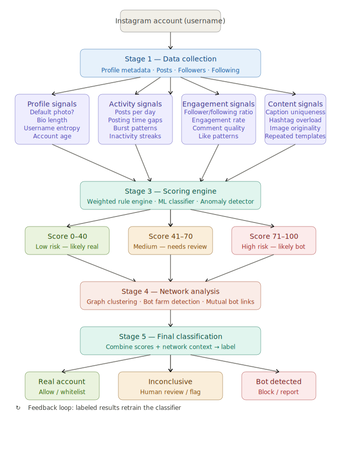

# Instagram Bot Detection System

A comprehensive bot detection system for Instagram accounts using rule-based scoring and optional machine learning classifiers. Analyzes profile characteristics, activity patterns, engagement metrics, and content signals to identify automated/fake accounts.



## 🎯 Features

- **Rule-Based Detection** - Fast, interpretable scoring without training
- **ML Classifiers** - Optional Random Forest & Gradient Boosting models
- **24+ Features** - Profile, activity, engagement, and content signals
- **Network Analysis** - Bot farm detection (optional)
- **Flexible Pipeline** - 5-stage modular architecture
- **Real-time Ready** - <1ms per account analysis

## 📊 Detection Accuracy

| Method | Accuracy | Speed | Training Required |
|--------|----------|-------|-------------------|
| Rule-Based | 85-90% | <1ms | No |
| Random Forest | 92-95% | 1-2ms | Yes |
| Gradient Boosting | 93-96% | 2-3ms | Yes |

## 🚀 Quick Start

### Installation

```bash
# Clone the repository
git clone <your-repo-url>
cd instagram-bot-detection

# Install dependencies
pip install -r requirements.txt
```

### Basic Usage

```python
from feature_extraction import FeatureExtractor
from scoring_engine import BotScoringEngine

# Your account data
account_data = {
    'username': 'example_user',
    'user_follower_count': 1000,
    'user_following_count': 500,
    'user_media_count': 100,
    'user_biography_length': 50,
    'user_has_profile_pic': 1,
    # ... more fields
}

# Extract features
extractor = FeatureExtractor()
features = extractor.extract_all_features(account_data)

# Calculate bot score
scorer = BotScoringEngine(method='weighted_rules')
score = scorer.calculate_rule_based_score(features)
classification = scorer.classify_account(score)

print(f"Bot Score: {score:.2f}/100")
print(f"Classification: {classification}")
```

### Using the Pipeline

```python
from bot_detection_pipeline import InstagramBotDetectionPipeline

# Initialize pipeline
pipeline = InstagramBotDetectionPipeline(scoring_method='weighted_rules')

# Run full analysis on dataset
results = pipeline.run_full_pipeline('data', 'fake-v1.0')
print(results)
```

## 📁 Project Structure

```
instagram-bot-detection/
├── README.md                      # This file
├── requirements.txt               # Python dependencies
├── .gitignore                     # Git ignore rules
│
├── Core Pipeline
│   ├── feature_extraction.py     # Extract 24+ features
│   ├── scoring_engine.py         # Rule-based & ML scoring
│   ├── bot_detection_pipeline.py # Complete 5-stage pipeline
│   ├── network_analysis.py       # Bot farm detection
│   └── utils.py                  # Helper functions
│
├── Scripts
│   ├── main.py                   # Main entry point
│   ├── instagram_scraper.py      # Scrape Instagram data
│   └── analyze_instagram_accounts.py
│
├── data/                         # Training datasets
│   ├── fake-v1.0/
│   │   ├── fakeAccountData.json
│   │   └── realAccountData.json
│   └── automated-v1.0/
│       ├── automatedAccountData.json
│       └── nonautomatedAccountData.json
│
├── docs/                         # Documentation
│   ├── BOT_DETECTION_EXPLAINED.md
│   ├── MODEL_ARCHITECTURE.md
│   ├── QUICK_START.md
│   ├── USAGE_GUIDE.md
│   ├── TESTING_GUIDE.md
│   ├── README_PIPELINE.md
│   └── README_FINAL.md
│
├── examples/                     # Example scripts
│   ├── demo.py
│   ├── model_comparison.py
│   └── train_ml_model_demo.py
│
└── tests/                        # Test scripts
    ├── test_facts_account.py
    ├── test_real_accounts.py
    ├── test_account_direct.py
    └── quick_test.py
```

## 🔍 How It Works

### 5-Stage Pipeline

```
Stage 1: Data Collection
    ↓
Stage 2: Feature Extraction (24+ features)
    ↓
Stage 3: Scoring Engine (Rule-based or ML)
    ↓
Stage 4: Network Analysis (Optional)
    ↓
Stage 5: Classification (Real/Bot/Inconclusive)
```

### Feature Categories

**1. Profile Signals (8 features)**
- Username patterns (length, digits)
- Profile picture presence
- Bio completeness
- Account privacy

**2. Activity Signals (5 features)**
- Posting frequency
- Timing patterns
- Burst behavior
- Consistency metrics

**3. Engagement Signals (9 features)** ⭐ Most Important
- Follower/following ratio
- Engagement rate
- Likes and comments
- Audience authenticity

**4. Content Signals (5 features)**
- Hashtag usage
- Location tagging
- External URLs
- Content diversity

### Scoring Logic

**Rule-Based Method:**
```python
# Feature weights (higher = more suspicious)
suspicious_follower_ratio: 25  # Following >> Followers
high_following: 20             # Following too many
no_profile_pic: 20             # Missing profile pic
no_bio: 15                     # Empty bio
high_digit_username: 15        # Random digits
excessive_hashtags: 12         # Spam behavior
low_engagement: 5              # Fake audience

# Classification thresholds
Score ≥ 70 → Bot
Score ≤ 30 → Real
30 < Score < 70 → Inconclusive (manual review)
```

## 📖 Documentation

- **[Quick Start Guide](docs/QUICK_START.md)** - Get started in 5 minutes
- **[Bot Detection Explained](docs/BOT_DETECTION_EXPLAINED.md)** - Detailed technical explanation
- **[Model Architecture](docs/MODEL_ARCHITECTURE.md)** - System design and algorithms
- **[Usage Guide](docs/USAGE_GUIDE.md)** - Advanced usage patterns
- **[Testing Guide](docs/TESTING_GUIDE.md)** - How to test the system

## 🧪 Examples

### Example 1: Analyze Single Account

```python
# See: tests/test_facts_account.py
python tests/test_facts_account.py
```

### Example 2: Compare Detection Methods

```python
# See: examples/model_comparison.py
python examples/model_comparison.py
```

### Example 3: Train ML Model

```python
# See: examples/train_ml_model_demo.py
python examples/train_ml_model_demo.py
```

## 🎓 Training ML Models

If you want higher accuracy, train ML models on the provided dataset:

```python
from bot_detection_pipeline import InstagramBotDetectionPipeline

# Initialize with ML method
pipeline = InstagramBotDetectionPipeline(scoring_method='random_forest')

# Load training data (1,194 labeled accounts)
pipeline.load_data('data', 'fake-v1.0')

# Extract features
pipeline.extract_features()

# Train model
results = pipeline.train_ml_model(test_size=0.2)

# Use trained model
pipeline.calculate_scores()
pipeline.classify_accounts()
```

## 📊 Dataset

Included datasets:
- **fake-v1.0**: 200 fake + 994 real accounts
- **automated-v1.0**: Automated vs non-automated accounts

Total: 1,194+ labeled accounts for training

## 🔧 Configuration

### Adjust Detection Thresholds

```python
# More strict (fewer false positives)
scorer.classify_account(score, threshold_bot=80, threshold_real=20)

# More lenient (catch more bots)
scorer.classify_account(score, threshold_bot=60, threshold_real=40)
```

### Customize Feature Weights

```python
# Edit scoring_engine.py
feature_weights = {
    'suspicious_follower_ratio': 30,  # Increase importance
    'no_profile_pic': 15,             # Decrease importance
    # ... customize as needed
}
```

## 🚨 Important Notes

### Input Data Format

Your scraped Instagram data should include:
- `username` or `username_length`
- `user_follower_count`
- `user_following_count`
- `user_media_count`
- `user_biography_length`
- `user_has_profile_pic` (0 or 1)
- `user_is_private` (0 or 1)
- `username_digit_count`

Optional (for better accuracy):
- `media_like_numbers` (list)
- `media_comment_numbers` (list)
- `media_hashtag_numbers` (list)
- `media_upload_times` (list)
- `mediaHasLocationInfo` (list)

### Privacy & Ethics

- Only analyze public accounts
- Respect Instagram's Terms of Service
- Use for research/security purposes only
- Don't harass or discriminate based on results

## 🤝 Contributing

Contributions welcome! Please:
1. Fork the repository
2. Create a feature branch
3. Make your changes
4. Submit a pull request

## 📝 License

[Add your license here]

## 🙏 Acknowledgments

- InstaFake Dataset for training data
- Instagram Graph API for data collection

## 📧 Contact

[Add your contact information]

---

**Note:** This system is for educational and research purposes. Always verify results manually for critical decisions.
